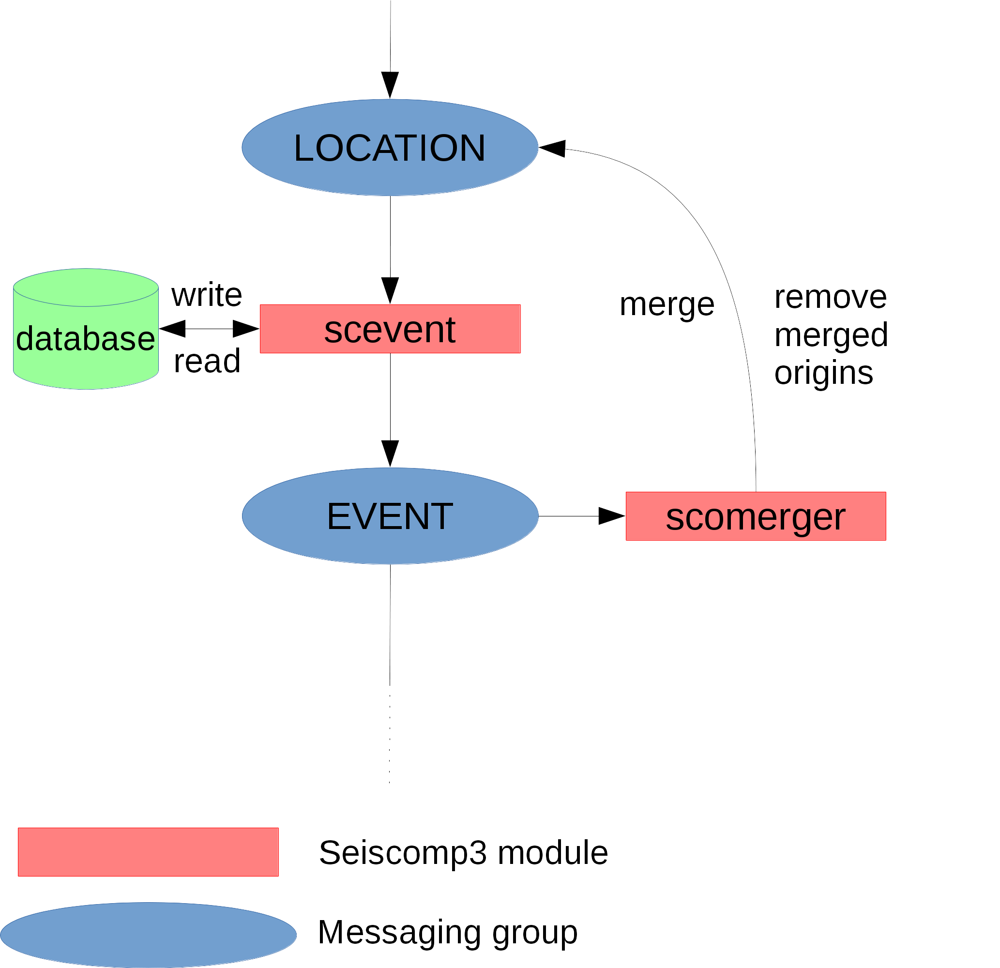

SCOMERGER
=========

`scomerger` is a seiscomp3 application which aims to merge origins from 2
differents authors.

It works like this:
- Receive the `EVENT` messages from `scevent`. `scomerger` lets `scevent`
  dispatch origins into events.
- If the preferred origin is already a merged origin, send a message to scevent
  to remove this merged origin. A new `EVENT` messages will be received by
  `scomerger`.
- If the preferred origin is from the primary author, merge the origin from
  the secondary author with it. A new origin is created with the arrivals of
  both origins and relocated with `LOCSAT`.
- Send a message to `scevent` to modify the database and recalculate a new
  preferred origin.

  > **Warning**
  >
  > Every modifications of the database must be done by `scevent`. That's why
  > we always send messages to it.

`scomerger` was designed to work separately from the mainstream to avoid nested
messages. `scomerger` indeed listen `EVENT` messaging group but also send
messages to it.



Installation
------------

1. Copy the different files into seiscomp3 folders:

    ```bash
    cp descriptions/scomerger.xml /path/to/seiscomp3/etc/descriptions/
cp init/scomerger.py /path/to/seiscomp3/etc/init/
cp scomerger /path/to/seiscomp3/bin/
    ```

2. Configure `scomerger`

3. Activate the seiscomp3 module:

    ```bash
    seiscomp enable scomerger
seiscomp start scomerger
    ```

Useful options
--------------

`scomerger` can be run on a particular event with the `-E` or `--event` option:

```bash
seiscomp exec scomerger -E eost2016ehix
```

It can be run on a period of time as well:

```bash
seiscomp exec scomerger --begin 2016-03-01T00:00:00.0 --end 2016-03-08T00:00:00.0
```

It is also possible to remove the merged origins with the `-R` option:

```bash
seiscomp exec scomerger -E eost2016ehix -R
```
